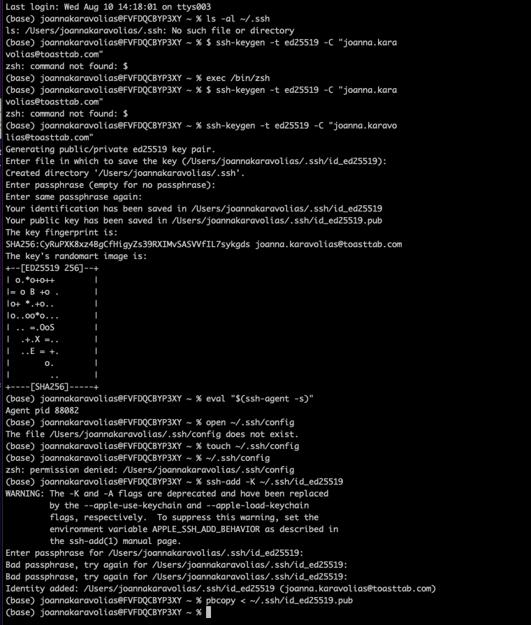
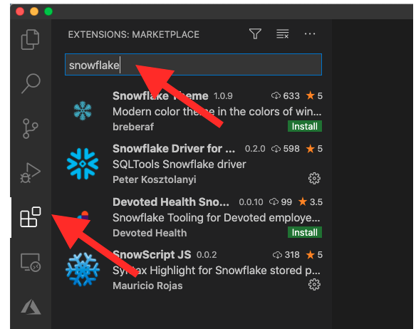
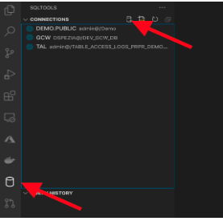
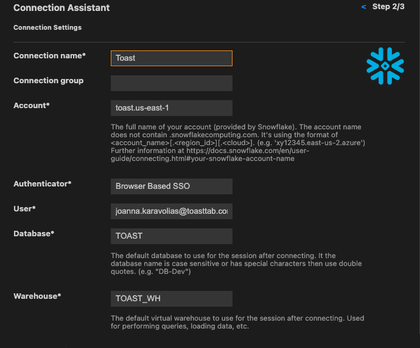

# Date Insight and Analytics Repo
 ## Getting Started - Setting up SSH Key

1. Check if you have an SSH Key - In terminal run this command: ls -al ~/.ssh
     - If an SSH key exists, check the directory for a public SSH key. THe following filenames are supported public keys for Github:
        - Id_rsa.pub
        - Id_ecdsa.pub
        - id_ed25519.pub
    - If you do not have any SSH key, the following line will output “No such file or directory”.  You must generate a new SSH key and add it your machine’s SSH agent.
2. Generate New SSH Key: 
    - Open terminal and paste the following text, substituting in your Github email address: `$ ssh-keygen -t rsa -b 4096 -C "your_email@example.com"`
    - You should now receive a ‘Generating public/private algorithm key pair’ message. 
    - When prompted to ‘Enter a file in which to save the key’ press Enter. This accepts the default location. 
    - At the prompt type a secure passphrase. This is the passphrase you will use everytime you push/pull into the main branch.
3. Adding you SSH key to the ssh-agent
    - Start the ssh-agent in the background with the following command: `eval "$(ssh-agent -s)"`
    - Check to see if you ssh/config file exists in the default location with: `open ~/.ssh/config`
        - If this file does not exist, create the file: `touch ~/.ssh/config`
        - Open your ssh file and add your SSH private key to the ssh-agent and store your passphrase in the keychain:  `ssh-add -K ~/.ssh/id_ed25519`
            - If you are adding an existing key with a different name replace id_ed25519 with the name of your private key file. 
4. Add the SSH key to you account in Github
    - Copy the ssh public key to your clipboard with the command: `pbcopy < ~/.ssh/id_ed25519.pub`
    - In the Github UI in the upper right corner of any page, click your photo and then click Settings. 
    - In the access section of the side bar click SSH and GPG Keys.
    - Click New SSH or Add SSH Key. 
    - In the title field add a description of the key. For example, it can be called ‘Toast Laptop’.
    - Paste the key into the Key field. 
    - Click Add SSH Key. 
    - You will need to provide your Github password to authenticate. 

## Cloning the DIA Repo
1. In terminal run: pwd to see the current file you are in
    - To navigate to the appropriate file `run cd ~/[FOLDER] `
    - Check to see if you are in the appropriate folder pwd
2. Once you are in the appropriate location, in the Github UI navigate to the DIA repo. In the top right click the green Code button and copy the SSH.

3. In your terminal, again check to make sure you are in the correct location run: `git clone git@github.com:toasttab/dia.git`
    -  You will be prompted to enter the SSH passphrase you chose when generating the SSH key
    - If completed successfully, you will see done at the end of the code. 

## Connecting Snowflake to an IDE
Connection Snowflake to an IDE will allow you to query Snowflake without using a Python connector. Additionally you can then push/pull code straight from the DIA repo to your local clone.  The IDE this documentation will walk through is Visual Studio Code but there are other options.

1. Download VS Code: https://code.visualstudio.com/download
2. Get the Snowflake extension in VS Code.
    - Open VS Code and navigate to the extensions plugin and search for Snowflake. 
    - Install the ‘Snowflake Driver for SQL Tools’ extension by pressing the green install button. 

3. Add a database:
    - Once the extension is installed click on the database barrel on the left column then click the database barrel with the +sign.

    - To add the Toast warehouse use the following fields:
        - Connection Name: Toast
        - Account: toast.us-east-1
        - Authentication: Browser Based SSO
        - User: your_email_address@toasttab.com
        - Database: TOAST
        - Warehouse: TOAST_WH

    - Click the Snowflake logo and enter the account information. 
        - A browser window will open up and should sign into Snowflake via Okta. The page will then say ‘This site can’t be reached.’ That is expected behavior.
    - Save the connection and test the connection. 
        - Within VS Code open a new file and run a query on the TOAST WH. A new login window may popup, but if successful results should populate in a pane within VS Code.

	
## Pushing and Pulling to the Repo

The above steps allow you to query Snowflake directly in an IDE, and push/pull from the IDE into the DIA repo. However you complete this last step there are a couple of steps to take.

When you cloned the DIA repo you created a version of the DIA repo on your local machine. As you work on queries on your own machine, and other team members work on theirs, pushing and pulling allows your local repo to be up-to-date with the main version and vice-versa.
1. In Terminal, checkout a branch with `git checkout <BRANCH NAME>`. `Git checkout` allows you navigate between branches. 
    - If you want to create a new branch use git branch <BRANCH NAME>.
2. Prior to starting work use git pull origin <branch name>. This will make your branch up to date with master in DIA remote. This is important if any changes have been merged since you last used this branch. 
3. In VS Code make all the changes you need. 
4. Use `git status` see all changes that have been made.
5. Use `git add` to add the files with changes you would like to track. 
    - `git add .` will add all files with changed not staged for commit
    - `git add <file>` allows you to select the file(s) to track changes
6. When ready commit your changes use command `git commit -m ‘COMMIT COMMENT’`
7. Push changes to remote using `git push origin <BRANCH NAME> to be able to open a PR in Github. 
8. In Github you should be able to navigate to the branch you are working in and open a new PR. 
9. When you are starting work again be sure you run the command git pull origin <BRANCH NAME> to be sure that the branch is up to date with all changes. 

